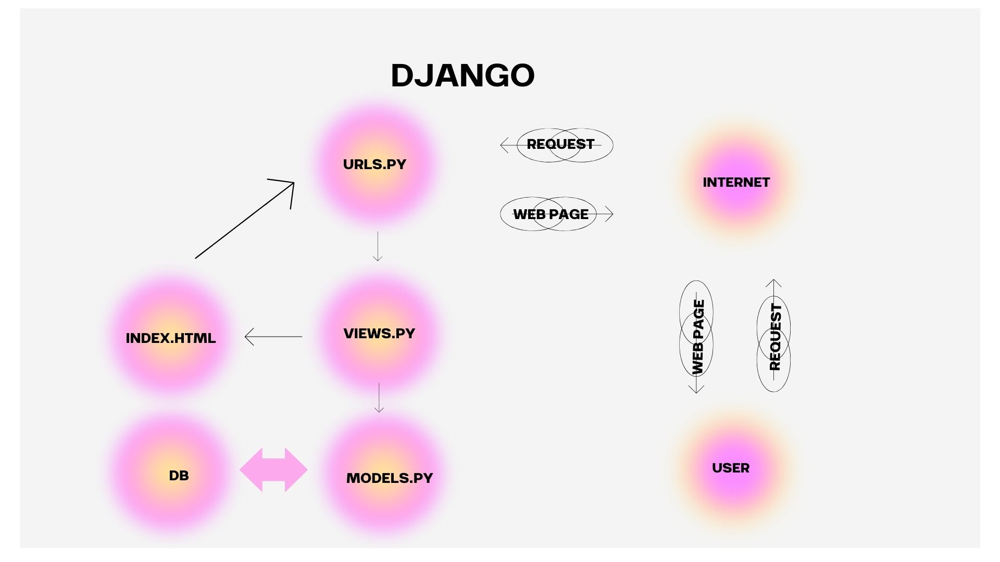

# Corée Élégante - Fashion Clothing

Ini adalah repository untuk **Corée Élégante**, sebuah aplikasi e-commerce yang dikembangkan untuk **Tugas Pemrograman Berbasis Platform**.

  
Tugas 2

## Deskripsi Proyek
Aplikasi **Corée Élégante** adalah platform e-commerce yang menjual berbagai macam pakaian bergaya Korea yang lucu dan trendi. Pengguna dapat menjelajahi koleksi fashion, melihat detail produk seperti:
- **Nama Produk**
- **Harga**
- **Deskripsi**

## Implementasi demi langkah
Berikut adalah beberapa langkah yang saya lakukan untuk menyelesaikan checklist tugas 2 ini:

1. **Mengonfigurasi Git**
   - Menginstal Git, mengatur nama pengguna dan email, lalu membuat SSH key untuk autentikasi otomatis tanpa password.

2. **Membuat Repositori**
   - Inisiasi repositori lokal dengan `git init`, membuat repositori di GitHub, dan menghubungkannya ke repositori lokal.

3. **Instalasi Virtual Environment**
   - Membuat virtual environment, mengaktifkannya, dan menginstal Django.

4. **Inisiasi Proyek Django**
   - Menjalankan perintah untuk memulai proyek baru, membuat aplikasi, dan mengonfigurasi URL serta pengaturan yang diperlukan.

5. **Mengonfigurasi Arsitektur MVT**
   - Mengonfigurasi URL routing dengan membuat `urls.py` di aplikasi dan menambahkannya ke `urls.py` proyek menggunakan `include()`.
   - Membuat template HTML di direktori `templates` aplikasi.
   - Menggunakan fungsi `render()` di `views.py` untuk menampilkan data dari model.
   - Mendefinisikan model di `models.py`, lalu menjalankan `makemigrations` dan `migrate` untuk menyinkronkan model dengan basis data.

## Bagan Request-Response Django

Berikut adalah bagan dari alur request client ke web aplikasi :

- **urls.py**: Bertugas untuk menerima request dari client dan memetakan request tersebut ke fungsi yang sesuai di `views.py`. Setiap path di URL ditangani oleh handler tertentu di views.

- **views.py**: Berfungsi untuk mengambil data dari `models.py` (jika diperlukan) dan merender template HTML yang akan dikirimkan kembali kepada client sebagai response. `views.py` mengelola logika di antara URL request, data, dan tampilan.

- **models.py**: Mengelola data yang disimpan dalam database dengan menggunakan Object-Relational Mapping (ORM) yang disediakan oleh Django. Di sini, struktur data dan relasinya didefinisikan dan digunakan oleh `views.py`.

- **templates**: Berisi file HTML yang di-render oleh `views.py` dan ditampilkan kepada pengguna sebagai output. Template ini dapat menggunakan sintaks Django untuk menyisipkan data dinamis dari server ke dalam tampilan statis.

## Fungsi Git dalam Pengembangan Perangkat Lunak
Git berfungsi sebagai sistem kontrol versi yang melacak perubahan kode, memungkinkan kolaborasi, dan mengelola branch untuk pengembangan fitur baru, serta mempermudah pengelolaan proyek perangkat lunak.

## Mengapa Framework Django Dijadikan Permulaan Pembelajaran Pengembangan Perangkat Lunak?
Menurut saya, framework Django dipilih karena full-stack framework-nya yang lengkap, mudah digunakan, memiliki dokumentasi kuat, dan prinsip "DRY" yang mendorong efisiensi serta kemudahan belajar bagi pemula.

## Mengapa Model pada Django Disebut sebagai ORM?
Model di Django disebut ORM (Object-Relational Mapping) karena memungkinkan pengembang bekerja dengan data sebagai objek Python tanpa menulis SQL secara langsung, sehingga memudahkan interaksi dengan basis data.

  
Tugas 3

### 1. Mengapa kita memerlukan data delivery dalam pengimplementasian sebuah platform?
Data delivery itu penting banget dalam platform karena memungkinkan kita mengirimkan data dari satu bagian sistem ke bagian lainnya, misalnya dari client ke server. Dengan ini memungkinkan aplikasi kita untuk dinamis dan interaktif, di mana data bisa dikirim, disimpan, dan diambil sesuai kebutuhan.

### 2. Mana yang lebih baik antara XML dan JSON? Mengapa JSON lebih populer dibandingkan XML?
JSON lebih sering digunakan daripada XML karena lebih ringan dan lebih mudah dibaca. Sintaks JSON lebih sederhana dan tidak bertele-tele seperti XML yang memerlukan banyak tag pembuka dan penutup. Oleh karena itu, JSON lebih cepat dan lebih efisien, terutama dalam aplikasi web modern.

### 3. Jelaskan fungsi dari method `is_valid()` pada form Django dan mengapa kita membutuhkan method tersebut?
Method `is_valid()` berfungsi untuk memvalidasi input dari form sebelum data disimpan. Kita butuh method ini untuk memastikan bahwa data yang diinput oleh pengguna sesuai dengan aturan yang sudah ditentukan di model. Kalau tidak valid, Django akan mengembalikan error, sehingga kita bisa menangani kesalahan sebelum data disimpan.

### 4. Mengapa kita membutuhkan `csrf_token` saat membuat form di Django? Apa yang dapat terjadi jika kita tidak menambahkan `csrf_token` pada form Django? Bagaimana hal tersebut dapat dimanfaatkan oleh penyerang?
`csrf_token` sangat penting untuk melindungi aplikasi dari serangan CSRF (Cross-Site Request Forgery). Tanpa `csrf_token`, form kita rentan terhadap serangan di mana penyerang bisa membuat request yang tidak sah dari luar aplikasi. Jika tidak ditambahkan, aplikasi bisa dieksploitasi dengan mengirimkan request berbahaya seolah-olah berasal dari pengguna sah.

### 5. Jelaskan bagaimana cara kamu mengimplementasikan checklist di atas secara step-by-step?

1. **Membangun Kerangka Views (Skeleton):**
   - Pertama, membuat folder `templates` dan file `base.html`
   File ini berfungsi sebagai kerangka dasar yang akan di-extend oleh halaman lain. Dengan menggunakan kerangka ini, desain web bisa lebih konsisten dan kode jadi lebih rapi.
   - Dalam `base.html`, menambahkan tag `` untuk membuat area yang nanti bisa diisi atau diubah oleh halaman lain.

2. **Mengganti Primary Key dari Integer ke UUID:**
   - Impor `uuid` di `models.py` dan mengganti field `id` di model `MoodEntry` dengan `UUIDField`. 
   Hal ini supaya setiap data mood punya ID unik yang lebih aman dan tidak bisa ditebak seperti ID integer.

3. **Membuat Form untuk Input Data Mood:**
   - Membuat file `forms.py` yang mendefinisikan form untuk input data
   - Kemudian, di `views.py`, membuat fungsi `create_clothing_entry` untuk menampilkan form dan menyimpan data yang di-submit oleh user ke database serta menambahkan `` di template HTML untuk mengamankan form dari serangan.

4. **Mengembalikan Data dalam Format XML dan JSON:**
   - Di sini membuat dua fungsi, `show_xml` dan `show_json`, di `views.py`. 
   Keduanya bertanggung jawab untuk mengubah data ke format XML atau JSON. Setelah itu, menambahkan URL routing di `urls.py` supaya bisa diakses di browser atau API.

5. **Testing dengan Postman:**
   - Setelah server Django berjalan, membuka Postman dan coba kirim request GET ke endpoint `xml/` atau `json/` untuk melihat apakah data muncul dengan format yang benar. 
   Hal ini membantu memvalidasi bahwa data sudah dikirim dan diterima dengan baik oleh API.

## Screenshoot Postman

  
Tugas 4 

## 1. Perbedaan antara `HttpResponseRedirect()` dan `redirect()`

- **HttpResponseRedirect()**: Kelas respons bawaan Django yang digunakan untuk membuat respons HTTP dengan status 302 (Found). Hal ini berarti sumber daya telah dipindahkan sementara ke URL lain. HttpResponseRedirect() mengharuskan Anda memberikan URL tujuan sebagai argumen secara eksplisit.
- **redirect()**: Fungsi utilitas tingkat tinggi yang juga mengembalikan respons pengalihan (redirect) namun lebih fleksibel. redirect() dapat menerima URL, nama tampilan, atau ID objek, dan secara otomatis menghasilkan URL yang sesuai.

## 2. Cara Kerja Penghubungan Model Product dengan User

Penghubungan antara model Product dan User dilakukan melalui relasi **ForeignKey**. Setiap Product terhubung dengan satu User, yang berarti satu pengguna dapat memiliki banyak Product (relasi one-to-many). Pada model Product, atribut ForeignKey digunakan untuk merujuk ke model User. Jika pengguna dihapus, semua Product yang terkait dengan pengguna tersebut akan dihapus juga secara otomatis karena pengaturan `on_delete=models.CASCADE`, yang memastikan integritas data.

## 3. Perbedaan antara Authentication dan Authorization
### Authentication (Otentikasi)
Otentikasi adalah proses untuk memverifikasi identitas pengguna. Biasanya, ini dilakukan dengan memeriksa username dan password yang dimasukkan oleh pengguna. Contohnya, ketika pengguna memasukkan username dan password dengan benar, mereka akan diizinkan mengakses aplikasi.

### Authorization (Otorisasi)
Otorisasi adalah proses untuk menentukan apakah pengguna yang sudah terotentikasi memiliki izin atau hak akses untuk melakukan tindakan tertentu atau mengakses sumber daya tertentu. Misalnya, meskipun pengguna berhasil login, mereka mungkin tidak diizinkan mengakses halaman admin kecuali memiliki hak akses yang sesuai.

**Apa yang Terjadi Saat Pengguna Login?**
1. **Authentication**: Sistem memeriksa apakah username dan password yang dimasukkan sesuai dengan data di database.
2. **Pembuatan Sesi**: Jika kredensial benar, Django membuat sesi untuk pengguna agar mereka tetap login selama sesi tersebut berlangsung.
3. **Authorization**: Setelah otentikasi, sistem memeriksa izin pengguna untuk menentukan tindakan yang diperbolehkan berdasarkan peran dan izin yang diberikan.

## 4. Implementasi Authentication dan Authorization di Django

### Authentication di Django
Django memiliki sistem otentikasi bawaan untuk memverifikasi identitas pengguna. Beberapa fitur utama meliputi:
- **Model User**: Django menggunakan model `User` dari modul `django.contrib.auth` untuk menyimpan informasi pengguna, seperti username, password, email, dan izin.
- **Fungsi Otentikasi**:
  - `authenticate()`: Memeriksa kredensial pengguna.
  - `login()`: Memulai sesi pengguna yang telah berhasil terotentikasi.
  - `logout()`: Mengakhiri sesi pengguna dan menghapus data sesi.

### Bagaimana Django Mengingat Pengguna yang Telah Login?
Django menggunakan sesi untuk mengingat pengguna yang telah login. Session ID disimpan dalam cookie pada browser pengguna, dan setiap kali pengguna mengunjungi aplikasi, cookie ini dikirimkan ke server sehingga server dapat mengenali pengguna dan menjaga status login mereka.

### Kegunaan Lain dari Cookies
- Menyimpan preferensi pengguna, seperti pengaturan bahasa atau item yang terakhir dilihat.
- Melacak aktivitas pengguna untuk tujuan analitik atau personalisasi.

Namun, tidak semua cookies aman. Cookies dapat disalahgunakan oleh serangan seperti cross-site scripting (XSS). Django menyediakan pengaturan keamanan seperti `HttpOnly`, yang mencegah akses ke cookie oleh JavaScript, serta `Secure`, yang memastikan cookie hanya dikirim melalui koneksi HTTPS.

## 6. Implementasi Checklist
### 1. Membuat Fungsi Registrasi, Login, dan Logout
- Menggunakan `UserCreationForm` untuk registrasi pengguna baru dan `AuthenticationForm` untuk login.
- Setelah login berhasil, sistem membuat session untuk pengguna.
- Saat logout, session dan cookie terkait akan dihapus.

### 2. Membuat Dummy Data untuk Pengguna
- Membuat dua akun pengguna.
- Menambahkan tiga item skincare dummy untuk setiap pengguna, yang dihubungkan melalui model `Item` menggunakan relasi ForeignKey.

### 3. Menghubungkan Model Item dengan User
- Menambahkan atribut `owner` ke model `Item` yang berupa `ForeignKey` ke model `User`. Ini memastikan setiap item dimiliki oleh pengguna yang tepat.

### 4. Menampilkan Username dan Menggunakan Cookie
- Menampilkan username pengguna yang login menggunakan `request.user.username` di halaman utama.
- Mencatat waktu login terakhir menggunakan cookie bernama `last_login`, yang dihapus saat pengguna logout.

### 5. Menyimpan dan Push ke GitHub
- Setelah memastikan fitur berjalan dengan baik, saya melakukan commit terhadap perubahan dan mem-push-nya ke GitHub, sesuai checklist yang ada.

  
Tugas 5

## 1. Urutan Prioritas CSS Selector
Ketika terdapat beberapa CSS selector yang diterapkan pada elemen HTML yang sama, browser menggunakan **specificity** untuk menentukan gaya yang diterapkan. Urutan prioritasnya adalah:

1. **Inline CSS**: Gaya yang ditulis langsung di elemen HTML menggunakan atribut `style`.
   - Contoh: `
Teks
`
   
2. **ID Selector**: Selector menggunakan ID elemen (misalnya `#myId`).
   - Contoh: `#myDiv { color: blue; }`
   
3. **Class, Attribute, dan Pseudo-class Selector**: Selector berdasarkan class (`.class`), atribut (`[type="text"]`), atau pseudo-class (`:hover`).
   - Contoh: `.myClass { color: green; }`
   
4. **Element/Tag Selector**: Selector berdasarkan elemen HTML (misalnya `div`, `p`, `h1`).
   - Contoh: `div { color: black; }`

Jika dua selector memiliki specificitas yang sama, aturan yang muncul **terakhir** dalam file CSS akan diterapkan (konsep **cascading**).

## 2. Pentingnya Responsive Design dalam Pengembangan Web
Responsive design adalah pendekatan desain web yang memungkinkan tampilan website beradaptasi dengan berbagai ukuran layar dan perangkat, seperti desktop, tablet, atau smartphone.

### Pentingnya Responsive Design:
- Pengalaman Pengguna (User Experience): Tampilan website tetap optimal di berbagai perangkat.
- SEO (Search Engine Optimization): Mesin pencari seperti Google memberikan peringkat lebih tinggi pada situs yang responsif.
- Aksesibilitas: Memastikan website dapat diakses dengan baik - dari perangkat apapun, memberikan pengalaman yang seragam.

### Contoh Aplikasi:
- Sudah Menerapkan Responsive Design: Instagram – antarmuka beradaptasi dengan baik di desktop dan mobile.
- Belum Menerapkan Responsive Design: Beberapa situs lama yang tidak dirancang untuk mobile masih menampilkan elemen yang tidak teratur pada perangkat kecil.

## 3. Perbedaan Margin, Border, dan Padding
Ketiganya merupakan bagian dari CSS Box Model, yang mengatur spasi di sekitar elemen.

### Margin: Ruang di luar border elemen, memberikan jarak antara elemen lain.
Contoh: margin: 10px; (jarak antar elemen dengan elemen lain).

### Border: Garis di sekitar elemen, memisahkan konten dan margin.
Contoh: border: 2px solid black; (border berwarna hitam di sekitar elemen).

### Padding: Ruang di dalam border, memberikan jarak antara konten elemen dan border.
Contoh: padding: 10px; (memberi ruang di dalam elemen, antara konten dan border).

## 4. Konsep Flexbox dan Grid Layout
### Flexbox
Flexbox adalah layout model di CSS yang digunakan untuk mengatur elemen dalam satu dimensi (baik baris maupun kolom). Kegunaan utamanya adalah untuk mempermudah perataan elemen, pembagian ruang, dan fleksibilitas konten.

### Grid Layout
CSS Grid adalah layout model dua dimensi yang memungkinkan kita untuk membuat tata letak kompleks dengan kolom dan baris. Grid lebih cocok untuk struktur halaman yang lebih kompleks dibanding Flexbox.

## 5. Pengimplementasian Checklist secara Step-by-Step: 
Berikut adalah beberapa yang saya lakukan untuk memenuhi checklist pada tugas ke 5 :
### 1. Menambahkan Tailwind ke Aplikasi
Saya mengintegrasikan Tailwind CSS ke dalam aplikasi dengan menambahkan CDN ke dalam base.html agar semua halaman aplikasi dapat menggunakan utility classes dari Tailwind untuk styling.

### 2. Menambahkan Fitur "Edit"
Saya membuat fungsi edit item di views.py untuk memungkinkan pengguna mengedit item yang telah ditambahkan. Saya juga menambahkan form di edit_item.html untuk mengisi detail item yang akan diubah.

### 3. Menambahkan Fitur "Delete"
Saya menambahkan fitur delete untuk menghapus item yang sudah di-add. Ini dilakukan dengan menambahkan fungsi delete di views.py dan menambahkan tombol delete di main.html yang memungkinkan pengguna menghapus item.

### 4. Membuat Navbar Sederhana
Saya mendesain navbar awal yang hanya berisi tombol logout dan ucapan selamat datang kepada pengguna, yang terhubung dengan template base.html agar muncul di semua halaman.

### 5. Konfigurasi Static Files
Saya melakukan pengaturan file statis di settings.py, menambahkan konfigurasi STATIC_URL dan STATICFILES_DIRS untuk memastikan bahwa CSS, gambar, dan JavaScript dapat diakses oleh aplikasi.

### 6. Membuat Sketsa Desain di Canva
Sebelum melakukan styling, saya membuat sketsa tampilan aplikasi menggunakan Canva untuk memvisualisasikan desain halaman dan navigasi.

### 7. Menambahkan Styling dengan Tailwind dan CSS
Saya melakukan styling halaman login, register, home, create clothing entry, dan edit clothingdengan kombinasi Tailwind dan CSS. Setiap halaman disesuaikan dengan layout dan tampilan yang diinginkan.

### 8. Mendesain Navbar dengan Beberapa Pilihan Button
Saya memperluas navbar dengan menambahkan beberapa pilihan navigasi:
Home: Mengarah ke main.html.
Products: Mengarah ke proucts.html.

### 9. Push Github dan PWS
Setelah selesai dengan pengembangan dan penambahan fitur, saya melakukan push ke repository GitHub dan melakukan deploy ke PWS untuk memastikan aplikasi dapat diakses secara online.

  
Tugas 6

### 1. Manfaat JavaScript
- **Interaktivitas**: Dengan JavaScript, elemen seperti tombol, form, atau konten dapat diubah secara dinamis tanpa memuat ulang halaman, sehingga meningkatkan pengalaman pengguna (user experience).
- **Kecepatan**: JavaScript dijalankan langsung di browser pengguna, yang berarti tidak ada waktu tunda komunikasi dengan server.
- **Kompatibilitas**: JavaScript mendukung berbagai browser dan platform, membuatnya fleksibel untuk berbagai jenis aplikasi.
- **Ekosistem yang Kuat**: Banyak framework dan pustaka JavaScript, seperti React, Angular, dan Vue.js, yang membantu mempercepat pengembangan.
- **Fungsi Asynchronous**: Dengan dukungan asynchronous, aplikasi dapat memuat data di latar belakang tanpa mengganggu interaksi pengguna.

### 2. Fungsi Penggunaan `await` dalam `fetch()`
`await` digunakan untuk menunggu hingga `fetch()` menyelesaikan eksekusi dan mengembalikan hasil. Ini sangat berguna untuk menangani operasi asynchronous, seperti mengambil data dari server, tanpa harus menggunakan callback atau promises secara eksplisit.

### 3. Mengapa Menggunakan Decorator csrf_exempt pada View untuk AJAX POST?
Decorator csrf_exempt digunakan untuk menonaktifkan pemeriksaan Cross-Site Request Forgery (CSRF) pada view tertentu, terutama saat mengembangkan aplikasi menggunakan AJAX POST. CSRF adalah mekanisme keamanan yang mencegah serangan berbahaya dengan memastikan bahwa permintaan POST berasal dari sumber yang sah.

Pada AJAX POST, sering kali token CSRF tidak otomatis dikirimkan, sehingga request akan diblokir kecuali token disertakan. Namun, penggunaan csrf_exempt harus dilakukan dengan hati-hati agar tidak membuka celah keamanan dalam aplikasi.

### 4. Mengapa Pembersihan Data Input Pengguna Dilakukan di Backend, Bukan di Frontend?
Pembersihan data di backend penting untuk menjaga integritas data dan keamanan aplikasi. Meskipun pembersihan di frontend bisa dilakukan untuk memberikan pengalaman pengguna yang lebih baik, hal tersebut tidak cukup untuk mencegah serangan berbahaya, seperti:

- *** Validasi di frontend mudah di-bypass ***: Pengguna dapat mematikan JavaScript di browser mereka atau mengirim request yang dimodifikasi menggunakan alat seperti Postman.
- *** Keamanan *** : Backend perlu memverifikasi dan memvalidasi semua data untuk mencegah SQL injection, XSS (cross-site scripting), dan serangan lainnya.
- *** Konsistensi *** : Jika pembersihan hanya dilakukan di frontend, ada risiko bahwa data yang tidak divalidasi dengan benar masuk ke sistem backend.

### 5. Jelaskan bagaimana cara kamu mengimplementasikan checklist di atas secara step-by-step (bukan hanya sekadar mengikuti tutorial)!

## 1. Menampilkan Pesan Kesalahan Saat Login Gagal
Pada tahap ini, saya menambahkan fitur untuk menampilkan pesan kesalahan jika login pengguna gagal, misalnya ketika pengguna salah memasukkan username atau password. Pesan ini memberikan informasi yang jelas agar pengguna bisa memperbaiki input mereka dan mencoba lagi.

## 2. Membuat Fungsi untuk Menambahkan Item Menggunakan AJAX
Saya membuat fungsi yang memungkinkan pengguna menambahkan item baru ke daftar secara asinkron menggunakan AJAX. Dengan demikian, pengguna dapat menambahkan item tanpa perlu memuat ulang halaman, yang membuat aplikasi lebih responsif.

## 3. Menambahkan Routing untuk Fungsi `add_item_entry_ajax`
Langkah ini melibatkan penambahan routing untuk menghubungkan fungsi `add_item_entry_ajax` ke URL tertentu. Dengan ini, server dapat menerima data yang dikirim oleh pengguna dan memprosesnya dengan benar.

## 4. Menampilkan Data Item dengan `fetch()` API
Untuk menampilkan daftar item yang sudah tersimpan, saya menggunakan `fetch()` API agar data bisa ditampilkan kembali tanpa harus memuat ulang halaman. Hal ini membuat pengalaman pengguna lebih cepat dan dinamis.

## 5. Membuat Modal Sebagai Form Input untuk Menambahkan Item
Saya membuat modal yang berfungsi sebagai form input agar pengguna dapat menambahkan item baru dengan lebih interaktif. Modal ini memungkinkan pengguna memasukkan data tanpa perlu berpindah halaman.

## 6. Menambahkan Item Baru Menggunakan AJAX
Ketika pengguna menambahkan item baru, data tersebut dikirimkan ke server menggunakan AJAX. Hal ini memungkinkan penambahan item tanpa harus me-refresh halaman, memberikan pengalaman pengguna yang lebih lancar dan tanpa gangguan.

## 7. Melindungi Aplikasi dari Serangan Cross-Site Scripting (XSS)
Untuk melindungi aplikasi dari potensi serangan XSS, saya melakukan beberapa langkah proteksi baik di frontend maupun backend.

- **Uji XSS**: Saya melakukan pengujian dengan menyisipkan skrip XSS untuk melihat apakah aplikasi rentan terhadap serangan ini.
- **Menambahkan `strip_tags` di Backend**: Fungsi `strip_tags` digunakan untuk membersihkan data dari tag HTML berbahaya sebelum data diproses oleh server.
- **Pembersihan Data dengan DOMPurify**: Di frontend, saya menggunakan DOMPurify untuk membersihkan data sebelum ditampilkan, memastikan bahwa data yang dihasilkan aman dari potensi XSS.

## 8. Add, Commit, dan Push Perubahan ke GitHub
Setelah semua perubahan dilakukan, saya menyimpan dan memperbarui proyek dengan melakukan `add`, `commit`, dan `push` ke repositori GitHub untuk memastikan proyek tersimpan secara online dan up-to-date.

## Author
**Waode Inaya Diza Mainah (PBP B)**